# SupportFlow — AI-Assisted Support Ticket Escalation System

SupportFlow is a full-stack support ticket management platform designed to prevent high-priority support requests from silently exceeding their service-level agreement (SLA) deadlines.

The platform provides separate workflows for Requesters, Agents, and Administrators, automatically monitors SLA deadlines, escalates overdue tickets, maintains a complete audit trail, and delivers persistent and real-time WebSocket notifications.

SupportFlow also includes an AI-assisted Stage-3 enhancement for SLA-based automatic reassignment. When an assigned ticket breaches its SLA, the system can automatically move the ticket to the least-loaded eligible Agent while preserving escalation, audit, notification, workload-capacity, and idempotency rules.

---

## Problem Statement

In many organizations, customer or internal support requests are managed through ticket queues. A common operational problem is that high-priority tickets can remain unattended or unresolved beyond their expected response window.

Without automated SLA enforcement, urgent tickets may depend entirely on someone manually noticing that they are overdue.

This creates several business problems:

- SLA commitments may be breached.
- High-priority tickets may remain with overloaded Agents.
- Supervisors must manually monitor overdue work.
- Priority labels may have no enforced operational consequence.
- Assignment, escalation, response, and resolution history may not be consistently auditable.
- Internal support information may accidentally be exposed to Requesters if role boundaries are poorly enforced.

SupportFlow addresses these problems by making SLA enforcement part of the application itself.

Each ticket receives an SLA deadline based on its configured priority. The system monitors active tickets, detects SLA breaches, escalates overdue tickets, records audit events, creates notifications, and can automatically reassign breached tickets to a more suitable Agent.

---

## Project Goals

SupportFlow was designed around the following goals:

1. Allow Requesters to create and track support tickets.
2. Allow Agents to manage assigned support work.
3. Allow Administrators to supervise tickets, users, SLA configuration, workload, and reports.
4. Enforce role-based authorization at both API and frontend levels.
5. Calculate and enforce SLA deadlines based on ticket priority.
6. Automatically detect and escalate overdue tickets.
7. Maintain an immutable-style audit trail of important ticket events.
8. Support public ticket conversations and private internal support notes.
9. Deliver persistent notifications and live WebSocket notifications.
10. Support configurable operational behavior through Admin settings.
11. Automatically reassign SLA-breached tickets to eligible Agents when configured.
12. Validate the application through backend regression tests and real browser E2E tests.
13. Run automated verification through GitHub Actions CI.
14. Demonstrate an AI-assisted build → test → diagnose → fix engineering workflow.

=============================================================================================================================================================

---

## Key Features

### Requester

- Secure registration and login.
- Email OTP-based forgot-password and reset-password workflow.
- Create support tickets with category and priority.
- View personal tickets only.
- Search, filter, sort, and paginate personal tickets.
- View ticket status, priority, assignment, and SLA information.
- View SLA deadline and SLA-risk information.
- Participate in public ticket conversations.
- View permitted ticket audit activity.
- Close resolved tickets.
- Reopen resolved tickets when enabled by Admin configuration.
- Receive persistent notifications.
- Receive real-time WebSocket notifications.
- View and update profile information.
- Change password securely.

### Agent

- Secure Agent authentication.
- View Agent dashboard and workload metrics.
- View assigned tickets.
- View escalated tickets.
- Search, filter, sort, and paginate assigned work.
- Start work on assigned tickets.
- Send public responses to Requesters.
- Add internal notes visible only to support staff.
- View internal ticket activity.
- Resolve active and escalated tickets.
- Provide a mandatory resolution summary.
- View SLA status and ticket history.
- Receive ticket assignment and reassignment notifications.
- Receive requester-response notifications.
- Receive reopen and close notifications.
- Receive SLA warning and escalation notifications.

### Administrator

- View system-wide dashboard metrics.
- Monitor total, active, unassigned, resolved, at-risk, and escalated tickets.
- Monitor Agent workload.
- View all tickets.
- Search by ticket information, Requester name, and Requester email.
- Filter tickets by priority, status, assignment state, and SLA state.
- Assign tickets to Agents.
- Reassign tickets between Agents.
- Change ticket priority.
- View complete ticket audit history.
- Add public responses when allowed by configuration.
- Add internal support notes.
- Manage users.
- Activate and deactivate users.
- Create Agent accounts.
- Configure SLA durations.
- Configure operational application settings.
- Enable or disable requester reopen behavior.
- Enable or disable Admin public responses.
- Enable or disable notifications and WebSocket notifications.
- Configure Agent workload capacity.
- Enable or disable automatic SLA reassignment.
- View reports.
- Export ticket, SLA, and Agent-performance CSV reports.

### Platform Capabilities

- JWT-based authentication.
- Password hashing.
- Role-based access control.
- SQLAlchemy ORM.
- Alembic database migrations.
- Database-backed SLA configuration.
- Automatic SLA monitoring.
- Automatic SLA escalation.
- Automatic least-loaded Agent reassignment.
- Deterministic Agent selection.
- Workload-capacity enforcement.
- Escalation idempotency.
- Ticket lifecycle validation.
- Audit-event generation.
- Persistent database notifications.
- Live WebSocket notifications.
- Search, filtering, sorting, and pagination.
- Centralized error handling.
- Structured logging.
- Responsive React interface.
- Mobile navigation.
- Automated backend testing with pytest.
- Browser E2E testing with Playwright.
- Python linting with Ruff.
- Frontend linting with ESLint.
- Production frontend build verification.
- GitHub Actions continuous integration.

  =============================================================================================================================================================

---

## Technology Stack

| Layer | Technology |
|---|---|
| Frontend | React + Vite |
| Styling | Tailwind CSS |
| Backend | FastAPI |
| ORM | SQLAlchemy |
| Database Migrations | Alembic |
| Development Database | SQLite |
| Authentication | JWT |
| Password Security | Passlib / bcrypt |
| Configuration | Pydantic Settings / environment variables |
| API Communication | REST |
| Real-Time Communication | WebSockets |
| Backend Testing | pytest |
| Browser E2E Testing | Playwright |
| Python Code Quality | Ruff |
| Frontend Code Quality | ESLint |
| CI/CD Verification | GitHub Actions |
| AI-Assisted Development | ChatGPT / AI-assisted build-test-fix workflow |

=============================================================================================================================================================

---

## System Architecture

SupportFlow follows a layered full-stack architecture.

┌───────────────────────────────────────────────────────┐
│                    React + Vite                       │
│                                                       │
│  Requester UI │ Agent UI │ Admin UI │ Notifications  │
└──────────────────────────┬────────────────────────────┘
                           │
                  REST API │ WebSocket
                           │
                           ▼
┌───────────────────────────────────────────────────────┐
│                       FastAPI                         │
│                                                       │
│ Auth │ Users │ Tickets │ Responses │ SLA │ Reports    │
│ Assignment │ Escalation │ Audit │ Notifications      │
│ Dashboard │ Admin Configuration │ WebSocket          │
└──────────────────────────┬────────────────────────────┘
                           │
                           ▼
┌───────────────────────────────────────────────────────┐
│                 SQLAlchemy ORM                        │
└──────────────────────────┬────────────────────────────┘
                           │
                           ▼
┌───────────────────────────────────────────────────────┐
│                       SQLite                          │
│                                                       │
│ Users │ Roles │ Tickets │ Responses │ Audit Events    │
│ SLA Config │ Notifications │ Password OTP │ App Config│
└───────────────────────────────────────────────────────┘

=============================================================================================================================================================


---

# Roles and Permissions

## User Roles and Permissions

SupportFlow uses three primary application roles.

| Capability | Requester | Agent | Admin |
|---|:---:|:---:|:---:|
| Register publicly | ✅ | ❌ | ❌ |
| Create ticket | ✅ | ❌ | ❌ |
| View own tickets | ✅ | ❌ | ❌ |
| View assigned tickets | ❌ | ✅ | ✅ |
| View all tickets | ❌ | ❌ | ✅ |
| Start work | ❌ | ✅ | ❌ |
| Public response | ✅ | ✅ | Configurable |
| Internal note | ❌ | ✅ | ✅ |
| Resolve ticket | ❌ | ✅ | ❌ |
| Close resolved ticket | ✅ | ❌ | ❌ |
| Reopen resolved ticket | Configurable | ❌ | ❌ |
| Assign ticket | ❌ | ❌ | ✅ |
| Reassign ticket | ❌ | ❌ | ✅ |
| Change priority | ❌ | ❌ | ✅ |
| Manage users | ❌ | ❌ | ✅ |
| Configure SLA | ❌ | ❌ | ✅ |
| Configure application | ❌ | ❌ | ✅ |
| View reports | ❌ | ❌ | ✅ |
| Export reports | ❌ | ❌ | ✅ |
| Receive notifications | ✅ | ✅ | ✅ |

Authorization is enforced by the backend even when the frontend hides an action.

For example:

- A Requester cannot access another Requester's ticket by manually changing the URL.
- An unassigned Agent cannot interact with another Agent's assigned ticket.
- A Requester cannot create an internal note by directly calling the API.
- Requesters and Agents cannot access Admin APIs.
- Internal notes are filtered by the backend before Requester conversation data is returned.

The React frontend additionally uses protected and role-specific routes to prevent inappropriate navigation, but backend authorization remains the security boundary.

=============================================================================================================================================================

## SLA and Escalation Engine

SLA enforcement is one of the core business features of SupportFlow.

### Priority-Based SLA Configuration

SLA durations are stored in the database and managed through the Admin interface rather than being permanently hardcoded into application logic.

This allows SLA policy to be changed without modifying source code.

When a ticket is created, the configured SLA policy is used to determine its deadline.

Conceptually:

```text
Ticket Created
      │
      ├── Priority
      │
      ▼
SLA Configuration
      │
      ▼
SLA Deadline
```

### SLA Boundary Rule

SupportFlow treats the SLA deadline as an inclusive boundary.

```text
current_time >= sla_deadline
```

Therefore:

| Time | SLA Result |
|---|---|
| Before deadline | Not breached |
| Exactly at deadline | Breached |
| After deadline | Breached |

This boundary is explicitly protected by automated tests because changing `>=` to `>` creates a subtle but meaningful business-rule defect.

### Automatic Escalation

The escalation processor evaluates eligible active tickets and detects overdue work.

Conceptually:

```text
Active Ticket
     │
     ▼
Check SLA deadline
     │
     ├── Not overdue ──────► No action
     │
     └── Overdue
             │
             ▼
         ESCALATED
             │
             ├── Audit event
             ├── Notification
             └── Optional auto-reassignment
```

### Escalation Safety Rules

SupportFlow protects escalation behavior with several rules:

- Tickets before their SLA deadline are not escalated.
- Tickets exactly at their SLA deadline are considered breached.
- Tickets after their deadline are escalated.
- Resolved tickets are not escalated.
- Closed tickets are not escalated.
- Already-escalated tickets are not repeatedly escalated.
- Repeated escalation processing remains idempotent.

These rules are covered by dedicated pytest regression tests.


=============================================================================================================================================================

## SLA-Based Automatic Reassignment

SupportFlow extends normal SLA escalation with configurable automatic Agent reassignment.

The goal is not only to identify an overdue ticket, but also to attempt to move that ticket away from an Agent who may no longer be the best person to handle it.

### Reassignment Flow

```text
Ticket breaches SLA
        │
        ▼
Ticket becomes ESCALATED
        │
        ▼
Is automatic reassignment enabled?
        │
        ├── No ─────────────► Keep current Agent
        │
        └── Yes
              │
              ▼
      Find eligible Agents
              │
              ▼
      Exclude current Agent
              │
              ▼
      Exclude inactive Agents
              │
              ▼
      Apply workload capacity
              │
              ▼
      Rank by active workload
              │
              ▼
      Lowest workload wins
              │
              ▼
      Agent ID breaks ties
              │
        ┌─────┴─────┐
        │           │
   Candidate      No candidate
        │           │
        ▼           ▼
    Reassign     Keep current
      ticket        Agent
        │           │
        └─────┬─────┘
              ▼
      Escalation succeeds
```

### Agent Eligibility Rules

A replacement Agent must:

- Have the Agent role.
- Be active.
- Not be the ticket's current assigned Agent.
- Be below the configured maximum active-ticket capacity.

Among eligible Agents, SupportFlow chooses the Agent with the lowest active workload.

If multiple Agents have the same workload, the lowest Agent ID is used as a deterministic tie-breaker.

This makes the selection behavior predictable and testable.

### No-Replacement Fallback

Automatic reassignment is an enhancement to escalation, not a requirement for escalation to succeed.

If no eligible replacement Agent exists:

```text
Ticket status        → ESCALATED
Assigned Agent       → unchanged
Escalation processing → successful
```

The system therefore never loses an SLA escalation merely because all alternative Agents are unavailable or at capacity.

### Configuration

Administrators can control this behavior using:

```text
auto_reassign_on_escalation
```

When disabled, SLA escalation continues normally without changing the assigned Agent.

### Idempotency

Automatic reassignment is also protected against repeated scheduler processing.

Once the ticket has already been escalated and processed, subsequent escalation checks do not continuously move the ticket between Agents.

=============================================================================================================================================================

## Audit Trail

SupportFlow maintains an audit history for important ticket actions.

The audit system provides accountability by recording meaningful business events rather than relying only on the ticket's current state.

Examples include:

- Ticket creation.
- Assignment.
- Reassignment.
- Status changes.
- Responses where applicable.
- Priority changes.
- SLA escalation.
- Automatic SLA reassignment.
- Resolution.
- Reopen and close activity.

### Why the Audit Trail Matters

A ticket may currently show:

```text
Status: ESCALATED
Assigned Agent: Agent B
```

but that alone does not explain how it reached that state.

The audit history can preserve the sequence:

```text
Ticket created
      ↓
Assigned to Agent A
      ↓
Agent started work
      ↓
SLA breached
      ↓
Ticket escalated
      ↓
Automatically reassigned
Agent A → Agent B
```

This provides a traceable history for operational investigation and accountability.

### Automatic Reassignment Auditing

A successful SLA auto-reassignment preserves both facts:

```text
SLA_ESCALATED
TICKET_AUTO_REASSIGNED
```

The reassignment event does not replace the SLA escalation event.

Automated tests verify that both events are generated when automatic reassignment succeeds.

=============================================================================================================================================================

## Notifications and Real-Time WebSockets

SupportFlow uses two complementary notification mechanisms:

```text
Persistent Database Notification
              +
      WebSocket Delivery
```

This means important notifications are stored for later retrieval while connected users can also receive updates immediately without refreshing the browser.

### Notification Architecture

```text
Business Event
     │
     ▼
Notification Service
     │
     ├──────────────► Database
     │                 │
     │                 ▼
     │            Notification history
     │
     ▼
WebSocket Service
     │
     ▼
Connected Browser
     │
     ▼
React Notification Context
     │
     ▼
Notification UI
```

### Example: Ticket Assignment

```text
Admin assigns ticket
        │
        ▼
Assignment service
        │
        ▼
Agent notification created
        │
        ├── persisted in database
        │
        └── pushed through WebSocket
                         │
                         ▼
                 Agent receives update
                 without page refresh
```

This behavior is validated by the Playwright E2E test:

```text
agent receives live assignment notification without refresh
```

### Automatic Reassignment Notifications

When an SLA breach successfully causes automatic reassignment:

**Previous Agent**

Receives a notification that the overdue ticket has been reassigned.

**New Agent**

Receives a notification that an escalated ticket has been assigned to them.

**Unrelated Agents**

Do not receive the reassignment notification.

Dedicated backend tests verify all three cases.

### Internal Note Privacy

Internal support notes must never be exposed to Requesters.

SupportFlow enforces this rule in backend authorization and response logic rather than relying only on the frontend to hide internal notes.

Automated backend and Playwright security tests verify that Requesters cannot see internal Agent notes.

### WebSocket Authentication

WebSocket connections are authenticated so that live application events are associated with an authenticated user.

The backend test suite includes dedicated WebSocket authentication coverage.

=============================================================================================================================================================

## Project Structure

SupportFlow separates backend application logic, frontend UI, automated tests, database migrations, and CI configuration.

```text
supportflow/
│
├── .github/
│   └── workflows/
│       └── ci.yml
│
├── backend/
│   ├── alembic/
│   │   └── versions/
│   │
│   ├── app/
│   │   ├── api/
│   │   │   ├── dependencies/
│   │   │   └── routes/
│   │   ├── core/
│   │   ├── db/
│   │   ├── models/
│   │   ├── schemas/
│   │   ├── repositories/
│   │   ├── services/
│   │   ├── websocket/
│   │   ├── scheduler/
│   │   ├── utils/
│   │   └── main.py
│   │
│   ├── tests/
│   │   ├── admin/
│   │   ├── audit/
│   │   ├── auth/
│   │   ├── dashboard/
│   │   ├── escalation/
│   │   ├── notifications/
│   │   ├── reports/
│   │   ├── security/
│   │   ├── sla/
│   │   ├── tickets/
│   │   ├── users/
│   │   └── websocket/
│   │
│   ├── alembic.ini
│   ├── pytest.ini
│   ├── requirements.txt
│   └── .env.example
│
├── frontend/
│   ├── public/
│   ├── src/
│   │   ├── api/
│   │   ├── assets/
│   │   ├── components/
│   │   ├── constants/
│   │   ├── contexts/
│   │   ├── hooks/
│   │   ├── layouts/
│   │   ├── pages/
│   │   ├── routes/
│   │   ├── services/
│   │   ├── utils/
│   │   ├── App.jsx
│   │   ├── main.jsx
│   │   └── index.css
│   │
│   ├── e2e/
│   │   ├── admin/
│   │   ├── agent/
│   │   ├── auth/
│   │   ├── notifications/
│   │   ├── requester/
│   │   ├── responsive/
│   │   └── security/
│   │
│   ├── package.json
│   ├── playwright.config.js
│   ├── eslint.config.js
│   └── vite.config.js
│
└── README.md
```

The structure keeps business logic, persistence, HTTP handling, UI components, and automated tests separated so that each layer can evolve independently.

=============================================================================================================================================================

## Environment Configuration

SupportFlow uses environment variables for configuration rather than embedding environment-specific values directly in source code.

Example configuration files are provided through `.env.example`.

Actual `.env` files should not be committed to source control.

### Backend

Create:

```text
backend/.env
```

from:

```text
backend/.env.example
```

Important backend configuration includes values such as:

```text
DATABASE_URL
SECRET/JWT configuration
CORS configuration
frontend URL
email/SMTP configuration
```

Use the exact variable names defined in the project's `.env.example` and backend Settings model.

### Frontend

Create:

```text
frontend/.env
```

from:

```text
frontend/.env.example
```

The frontend environment configuration defines the backend/API location used by the Vite application.

### Security

Never commit:

```text
.env
database credentials
JWT production secrets
SMTP passwords
API secrets
```

Only `.env.example` files containing safe placeholders should be committed.

=============================================================================================================================================================

## Local Development Setup

### Prerequisites

Install:

- Python 3.11+
- Node.js and npm
- Git

### 1. Clone the Repository

```bash
git clone <repository-url>
cd supportflow
```

### 2. Create Backend Virtual Environment

On Windows PowerShell:

```powershell
cd backend
python -m venv venv
.\venv\Scripts\Activate.ps1
```

### 3. Install Backend Dependencies

```powershell
pip install -r requirements.txt
```

### 4. Configure Backend Environment

Create the local environment file from the provided example:

```powershell
Copy-Item .env.example .env
```

Review `.env` and provide the required local configuration values before starting the application.


### 5. Initialize the Database

SupportFlow uses SQLAlchemy for persistence and Alembic for schema migrations.

Apply all migrations:

```powershell
alembic upgrade head
```

This creates or updates the database schema to the latest application revision.

To inspect the current migration:

```powershell
alembic current
```

To inspect migration history:

```powershell
alembic history
```

Do not manually create production schema changes directly in SQLite. Schema evolution should be represented through Alembic migrations.

=============================================================================================================================================================

## Database Isolation

SupportFlow separates development, backend-test, and browser-E2E data.

```text
                    SupportFlow
                        │
       ┌────────────────┼────────────────┐
       │                │                │
       ▼                ▼                ▼
 supportflow.db   test_supportflow.db   supportflow_e2e.db
       │                │                │
       ▼                ▼                ▼
 Development         pytest          Playwright E2E
```

### Development Database

```text
supportflow.db
```

Used for:

- Manual application use.
- Swagger testing.
- Postman testing.
- Normal local frontend/backend development.

### Backend Test Database

```text
test_supportflow.db
```

Used only by:

```bash
pytest
```

Backend tests use isolated test setup and should not operate on the normal development database.

### Browser E2E Database

```text
supportflow_e2e.db
```

Used by the running FastAPI application during Playwright browser tests.

It contains deterministic E2E accounts and data required for cross-role browser workflows.

Keeping pytest and Playwright databases separate prevents backend test fixtures from interfering with persistent browser-test state.

Runtime SQLite database files should not be committed to Git.

=============================================================================================================================================================

### 6. Start the Backend

From:

```text
supportflow/backend
```

with the virtual environment activated:

```powershell
python -m uvicorn app.main:app --reload
```

The backend is available locally at:

```text
http://127.0.0.1:8000
```

FastAPI interactive API documentation is available at:

```text
http://127.0.0.1:8000/docs
```

Keep this terminal running while using the frontend.

=============================================================================================================================================================

### 7. Install and Start the Frontend

Open another terminal:

```powershell
cd frontend
npm install
```

Start Vite:

```powershell
npm run dev
```

For the host configuration used by the E2E environment:

```powershell
npm run dev -- --host 127.0.0.1
```

The application is then available at:

```text
http://127.0.0.1:5173
```

During local development:

```text
Browser
   │
   ▼
React / Vite :5173
   │
   │ REST + WebSocket
   ▼
FastAPI :8000
   │
   ▼
SQLite
```

---

## API Verification

### Swagger

FastAPI provides interactive API documentation at:

```text
http://127.0.0.1:8000/docs
```

Swagger was used during development to inspect endpoints, request schemas, authentication requirements, and API responses.

### Postman

Backend APIs were also verified incrementally with Postman during implementation.

The development workflow for API modules followed:

```text
Implement API
     ↓
Start FastAPI
     ↓
Test through Swagger/Postman
     ↓
Verify status + response
     ↓
Add automated regression coverage
```

This allowed individual APIs to be verified before later frontend and E2E integration.

---

## Automated Testing

### Backend Regression Testing — pytest

From:

```text
supportflow/backend
```

activate the virtual environment and run:

```powershell
pytest -v
```

Current verified result:

```text
98 passed
```

The backend suite covers major business and security behavior including:

- Registration.
- Authentication.
- JWT-protected endpoints.
- Role-based access control.
- User management.
- Dashboard authorization.
- Ticket creation.
- Ticket ownership.
- Assignment.
- Public responses.
- Internal-note privacy.
- Ticket status workflow.
- SLA configuration.
- SLA boundary conditions.
- Escalation.
- Escalation idempotency.
- Automatic reassignment.
- Agent eligibility.
- Agent workload capacity.
- Reassignment fallback.
- Reassignment auditing.
- Reassignment notifications.
- Reports and CSV export.
- WebSocket authentication.

### Backend Linting

Run:

```powershell
ruff check app
```

Current verified result:

```text
All checks passed!
```

============================================================================================================================================================

### Browser E2E Testing — Playwright

Playwright tests exercise the application through a real browser while the React frontend and FastAPI backend are running together.

From:

```text
supportflow/frontend
```

run:

```powershell
npx playwright test
```

Current verified result:

```text
24 passed
```

The E2E suite covers workflows such as:

- Requester login.
- Invalid login handling.
- Public registration.
- Protected routes.
- Critical-ticket creation.
- Ticket search and filtering.
- Admin assignment.
- Agent workflow.
- Ticket resolution.
- Requester closure.
- Complete cross-role ticket lifecycle.
- Live WebSocket assignment notification.
- Internal-note privacy.
- Role-route authorization.
- Cross-requester ticket access protection.
- Admin application configuration.
- SLA configuration.
- User activation/deactivation.
- Responsive mobile navigation.

Playwright runs with one worker for deterministic database-mutating E2E workflows.

### Frontend Quality Verification

Run ESLint:

```powershell
npm run lint
```

Create a production build:

```powershell
npm run build
```

The production build verifies that the React/Vite application can be compiled successfully for deployment.

The final local verification baseline is:

```text
Backend pytest       98 / 98 passed
Backend Ruff         passed
Frontend ESLint      passed
Frontend Vite build  passed
Playwright E2E       24 / 24 passed
```

---

## Full Local E2E Verification

The Playwright suite must run against the dedicated E2E database rather than the pytest database.

### Terminal 1 — Backend

```powershell
cd backend
.\venv\Scripts\Activate.ps1

$env:DATABASE_URL="sqlite:///./supportflow_e2e.db"
$env:CORS_ORIGINS="http://localhost:5173,http://127.0.0.1:5173"
$env:FRONTEND_URL="http://127.0.0.1:5173"

python -m uvicorn app.main:app
```

### Terminal 2 — Frontend

```powershell
cd frontend
npm run dev -- --host 127.0.0.1
```

### Terminal 3 — Playwright

```powershell
cd frontend
npx playwright test
```

Expected:

```text
24 passed
```

Do not run the Playwright environment against `test_supportflow.db`, because that database belongs to the isolated pytest suite.

============================================================================================================================================================

## Deliberate RED → GREEN Regression Demonstration

SupportFlow includes a deliberate regression exercise to demonstrate that the automated tests detect a genuine business-rule defect rather than merely confirming successful code.

### Business Rule Under Test

A ticket must be considered SLA-breached when the current time is **equal to or later than** its SLA deadline.

Correct condition:

```python
current_time >= sla_deadline
```

The backend regression suite explicitly covers three SLA boundaries:

```text
Before deadline       → must NOT escalate
Exactly at deadline   → MUST escalate
After deadline        → MUST escalate
```

### Deliberate Defect

For the RED run, the inclusive comparison was deliberately changed from:

```python
current_time >= sla_deadline
```

to:

```python
current_time > sla_deadline
```

This introduces a realistic boundary defect.

A ticket checked at exactly its SLA deadline would incorrectly remain un-escalated.

### RED Result

The targeted SLA regression test detected the defect:

```text
test_ticket_exactly_at_sla_deadline_escalates
FAILED
```

The failure demonstrated that the automated test suite protects an actual business requirement.

### Fix

The original inclusive boundary was restored:

```python
current_time >= sla_deadline
```

The targeted test was executed again and returned to GREEN.

The complete regression suite was then rerun to verify that the correction did not introduce unrelated regressions.

### Final Verification

```text
Targeted SLA boundary test     PASS
Escalation tests               PASS
Full backend regression        98 passed
Playwright browser regression  24 passed
```

This RED → GREEN exercise provides concrete evidence that SupportFlow's tests can detect and prevent subtle SLA regressions.

### Why This Regression Matters

The deliberate defect was intentionally small but business-significant.

A simple CRUD validation failure would not adequately demonstrate the value of automated regression testing. SLA boundary behavior is more meaningful because a one-character comparison change can alter real operational behavior.

```text
>=   correct
>    incorrect at the exact deadline
```

Without the dedicated boundary test, this defect could be difficult to notice during normal manual testing.

The exercise demonstrates:

- Business-rule-focused automated testing.
- Boundary-value testing.
- Failure reproduction.
- Root-cause isolation.
- Targeted correction.
- Full regression verification.

---

## Stage-3 AI-Assisted Change Loop

After establishing a stable application and automated regression baseline, SupportFlow was extended through an AI-assisted engineering change.

### Baseline Before the Change

Before the Stage-3 extension:

```text
Backend regression suite   82 passed
Playwright E2E suite       24 passed
```

The existing application already supported SLA detection and escalation.

### New Requirement

The new requirement was:

> When an assigned ticket breaches its SLA, automatically attempt to reassign it to the least-loaded eligible Agent without breaking the existing escalation behavior.

This requirement deliberately interacts with existing SLA, assignment, audit, notification, configuration, and security logic.

### Change Analysis

The feature required more than simply replacing `assigned_agent_id`.

The implementation had to preserve several existing invariants:

```text
SLA breach
    │
    ├── escalation must still happen
    ├── existing escalation audit must remain
    ├── existing notifications must remain
    ├── processing must remain idempotent
    │
    └── optional reassignment
            │
            ├── exclude current Agent
            ├── exclude inactive Agents
            ├── enforce Agent capacity
            ├── calculate active workload
            ├── choose least-loaded Agent
            ├── deterministic tie-breaking
            ├── preserve fallback behavior
            ├── create reassignment audit
            └── notify affected Agents
```

### AI-Assisted Engineering Workflow

The change followed this loop:

```text
Existing stable system
        ↓
New feature requirement
        ↓
AI-assisted impact analysis
        ↓
Identify affected modules
        ↓
Implement feature
        ↓
Add focused automated tests
        ↓
Run tests
        ↓
Analyze failures
        ↓
Correct implementation
        ↓
Run focused regression
        ↓
Run complete backend regression
        ↓
Run browser E2E regression
        ↓
Run CI on clean GitHub environment
```

AI assistance accelerated implementation and reasoning, but automated tests remained the source of verification.

### New Regression Coverage

The Stage-3 change added tests for:

- Least-loaded Agent selection.
- Current Agent exclusion.
- Inactive Agent exclusion.
- Agent capacity enforcement.
- No-replacement fallback.
- Configuration toggle behavior.
- Reassignment idempotency.
- Reassignment audit creation.
- Old Agent notification.
- New Agent notification.
- Unrelated Agent notification isolation.
- Preservation of existing escalation audit behavior.

### Result

The backend suite increased from:

```text
82 tests
```

to:

```text
98 tests
```

while the existing browser suite remained:

```text
24 tests
```

and continued to pass.

Final result:

```text
Existing functionality       preserved
New functionality            covered
Backend regression           98 / 98 passed
Browser E2E regression       24 / 24 passed
```
============================================================================================================================================================

---

## Continuous Integration with GitHub Actions

SupportFlow uses GitHub Actions to reproduce the project's verification process on a clean CI runner.

The workflow is defined in:

```text
.github/workflows/ci.yml
```

### CI Architecture

```text
                 Git Push / Pull Request
                           │
              ┌────────────┴────────────┐
              │                         │
              ▼                         ▼
       Backend Tests             Frontend Checks
              │                         │
              │                         │
        Python 3.11                 Node.js
        Dependencies                npm ci
        Ruff                        ESLint
        pytest                      Vite build
              │                         │
              └────────────┬────────────┘
                           │
                           ▼
                    Playwright E2E
                           │
                           ├── Fresh E2E database
                           ├── Alembic migrations
                           ├── E2E seed
                           ├── FastAPI
                           ├── React/Vite
                           ├── Chromium
                           ├── 24 browser tests
                           └── Playwright artifact
```

### Backend CI

The backend job verifies:

```text
Dependency installation
        ↓
Ruff
        ↓
pytest
        ↓
98 tests
```

### Frontend CI

The frontend job verifies:

```text
npm ci
   ↓
ESLint
   ↓
Vite production build
```

### E2E CI

The E2E job creates a clean browser-test environment rather than relying on a developer's existing local database.

It:

1. Creates the E2E database through migrations.
2. Seeds deterministic E2E accounts.
3. Starts FastAPI.
4. Starts the Vite frontend.
5. Waits for both services to become available.
6. Installs Playwright Chromium.
7. Runs all browser tests.
8. Uploads the Playwright HTML report.

Current verified CI result:

```text
Backend Tests             PASS
Frontend Lint and Build   PASS
Playwright E2E            24 / 24 PASS
```

This proves that the application and automated tests work on a clean GitHub-hosted environment rather than only on the original development machine.

### CI Test Evidence

Playwright reports are uploaded as GitHub Actions artifacts, allowing browser-test evidence to be inspected after workflow execution.

When browser tests fail, test artifacts can also be retained to assist with diagnosis.

---

## Security Engineering

SupportFlow applies security controls at the backend boundary rather than relying only on frontend visibility.

### Authentication

Protected APIs require authenticated JWT credentials.

Invalid, missing, or unauthorized authentication is rejected by the backend.

### Password Security

User passwords are stored using secure password hashing rather than plaintext passwords.

### Role-Based Access Control

Backend authorization distinguishes:

```text
REQUESTER
AGENT
ADMIN
```

Role restrictions are independently tested.

### Registration Protection

Public registration creates Requester accounts.

Clients cannot inject an elevated role such as Agent or Admin through the public registration request.

This behavior is protected by automated regression testing.

### Resource-Level Authorization

Authorization also applies to individual resources.

For example:

```text
Requester A
     │
     ├── Own ticket       → allowed
     │
     └── Requester B ticket → denied
```

This prevents horizontal privilege escalation.

### Internal Note Privacy

Internal Agent/Admin notes are filtered by the backend and are not exposed to Requesters.

This behavior is verified at both backend and browser-test levels.

### Administrative Boundaries

Requester and Agent accounts cannot access protected Admin operations such as:

- User management.
- SLA configuration.
- Application configuration.
- Administrative reporting.

### Environment Secrets

Runtime secrets and environment-specific configuration belong in `.env` or deployment secret configuration and should not be committed to Git.

The repository should contain only safe `.env.example` templates.

---

## Known Limitations and Future Improvements

SupportFlow is designed as an assessment/demo-ready full-stack application. Several areas could be extended for a larger production deployment.

### PostgreSQL

SQLite keeps local setup and automated assessment simple.

A production deployment with significant concurrent traffic could migrate persistence to PostgreSQL while retaining SQLAlchemy and Alembic.

### Distributed Background Processing

The current SLA scheduler is appropriate for the application's deployment model.

At larger scale, SLA processing could move to a distributed task system with dedicated workers and distributed locking.

### WebSocket Scaling

A single application instance can manage WebSocket connections directly.

A horizontally scaled deployment could introduce a shared pub/sub layer such as Redis so notifications can propagate across multiple backend instances.

### Email Infrastructure

Production email delivery could use a managed transactional email provider with delivery tracking, retry policies, and bounce handling.

### Observability

Production monitoring could be extended with:

- Centralized structured logs.
- Metrics.
- Distributed tracing.
- SLA-processing telemetry.
- Alerting.

### Database Concurrency

SQLite is intentionally convenient for development and assessment. PostgreSQL would provide stronger concurrency characteristics for a multi-instance production environment.

---

## E2E Demo Accounts

The automated E2E environment uses deterministic accounts for browser testing:

```text
Requester
requester.e2e@example.com

Agent
agent.e2e@example.com

Secondary Agent
agent2.e2e@example.com

Administrator
admin.e2e@example.com
```

These accounts belong to the dedicated E2E environment.

Production credentials or private secrets must never be committed to the repository.

---

## Recommended Demo Flow

A complete SupportFlow demonstration can follow this sequence:

### 1. Requester

```text
Login
  ↓
Create high/critical-priority ticket
  ↓
View generated SLA information
  ↓
View ticket in My Tickets
```

### 2. Administrator

```text
Login
  ↓
Open All Tickets
  ↓
Locate new ticket
  ↓
Assign Agent
```

### 3. Real-Time Notification

Keep the Agent session open while the assignment occurs.

The Agent receives the assignment notification through WebSocket without refreshing the page.

### 4. Agent

```text
Open Assigned Tickets
  ↓
Open ticket
  ↓
Start work
  ↓
Add public response
  ↓
Add internal note
```

### 5. Privacy Verification

Return to the Requester account.

The Requester can see the public response but cannot see the internal Agent note.

### 6. Resolution

```text
Agent
  ↓
Resolve ticket
  ↓
Enter resolution summary
```

Then:

```text
Requester
  ↓
View resolved ticket
  ↓
Close ticket
```

### 7. Admin Features

Demonstrate:

- User management.
- SLA settings.
- Application configuration.
- Reports/export.
- Dashboard metrics.

### 8. Automated Engineering Evidence

Finish the demonstration with:

```text
pytest -v
→ 98 passed

npx playwright test
→ 24 passed

GitHub Actions
→ all CI jobs green
```

Then explain the deliberate SLA boundary RED → GREEN exercise and Stage-3 automatic reassignment enhancement.


---

## Screenshots


## Screenshots

### Authentication

#### Register Account

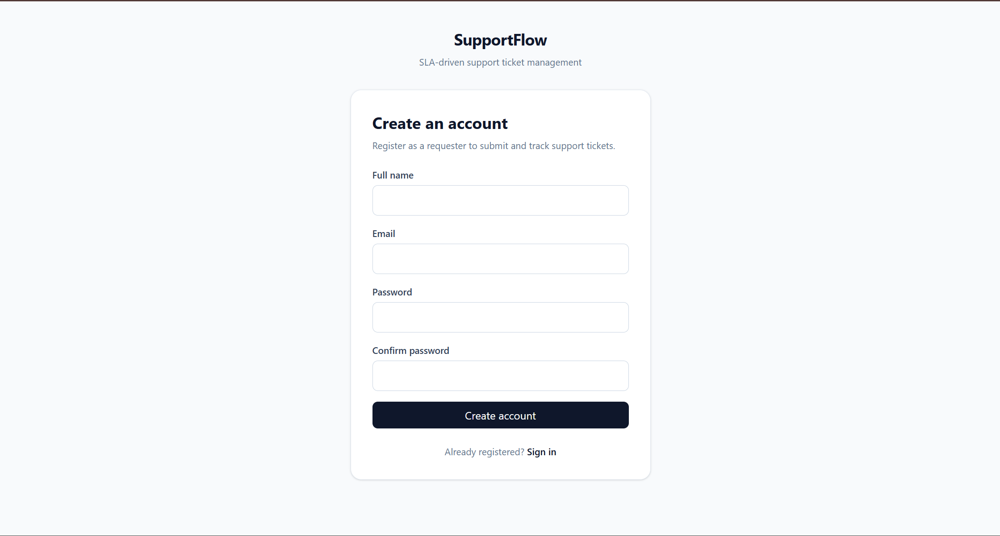

#### Login

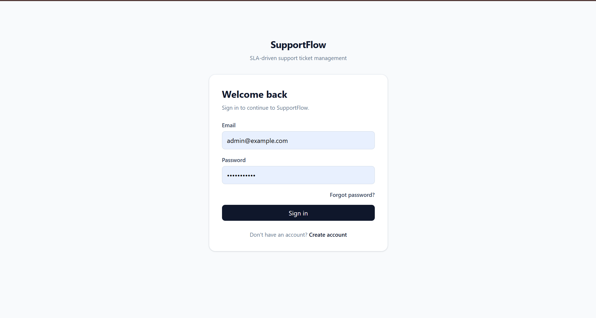

#### Forgot Password

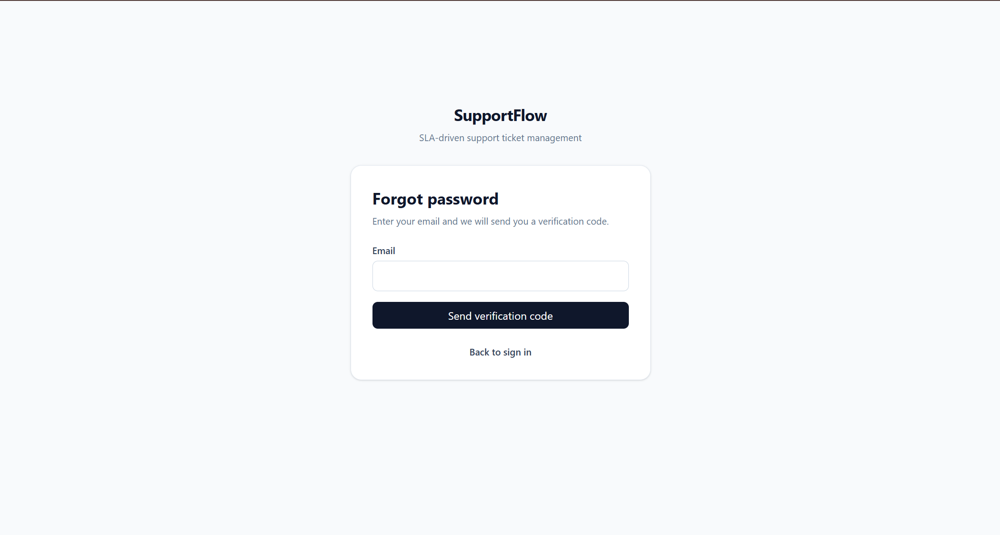

### Requester Experience

#### Requester Dashboard

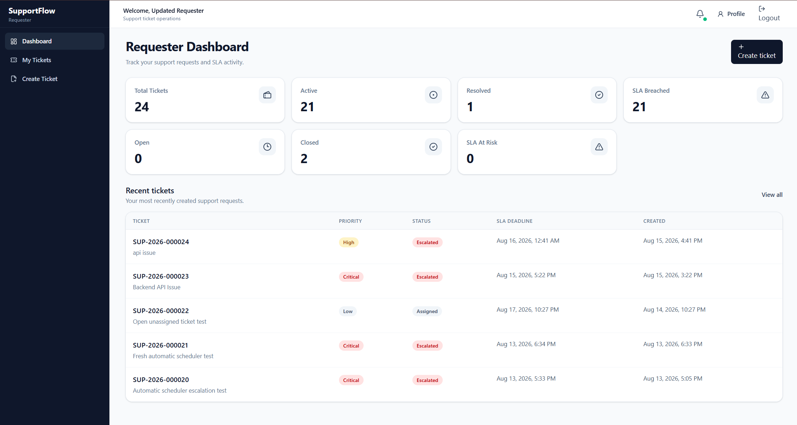

#### Create Ticket

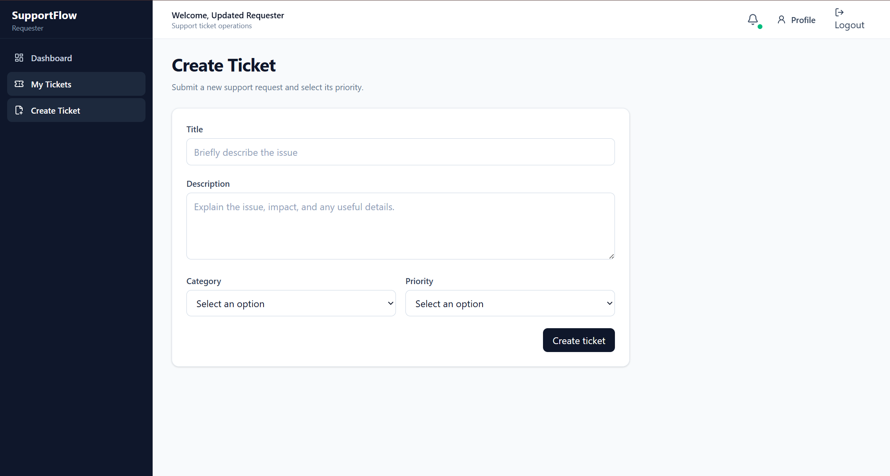

### Agent Experience

#### Agent Dashboard

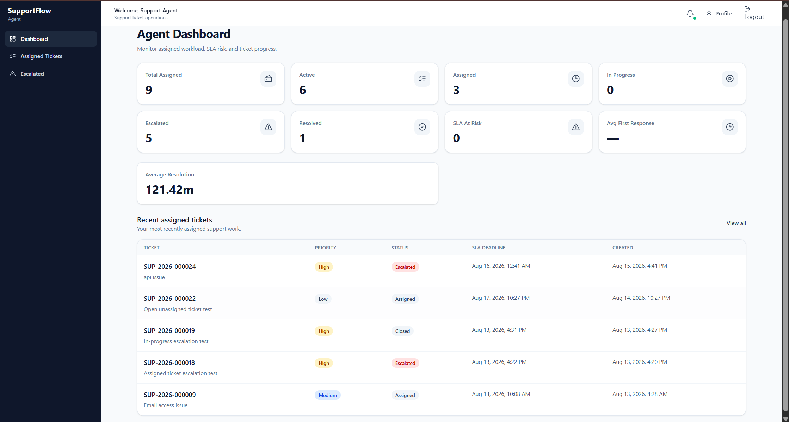

#### Ticket Details and Conversation

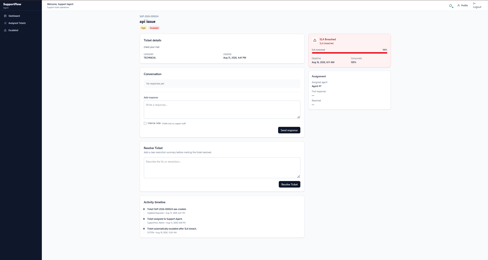

### Administrator Experience

#### Admin Dashboard

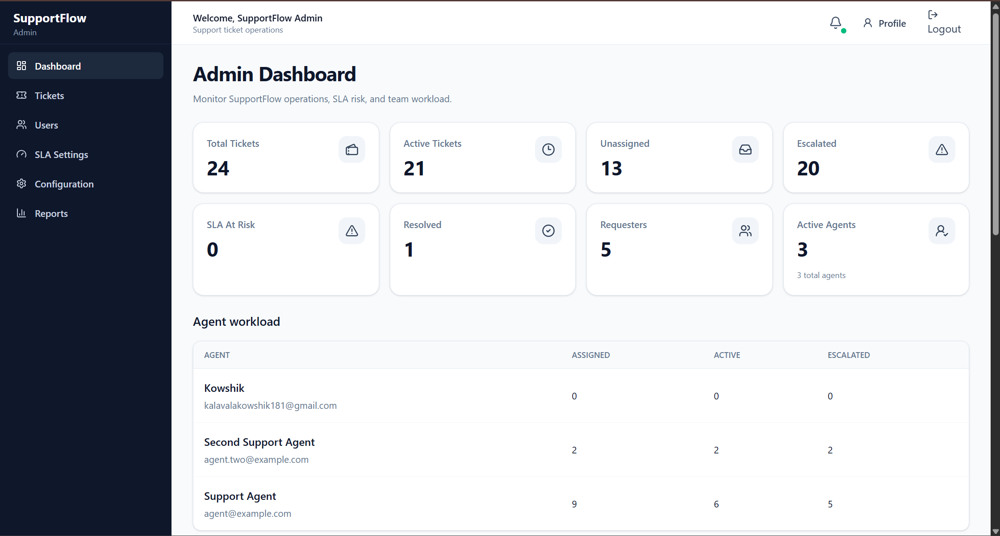

#### SLA Settings

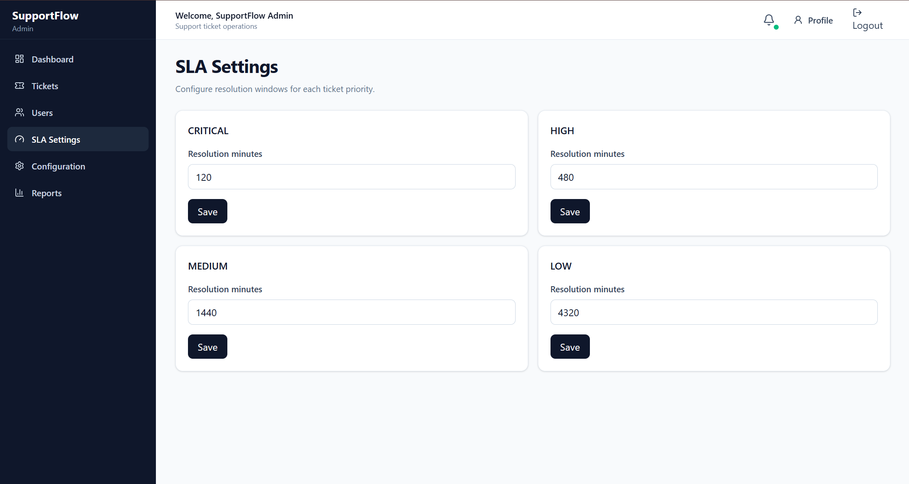

#### User Management

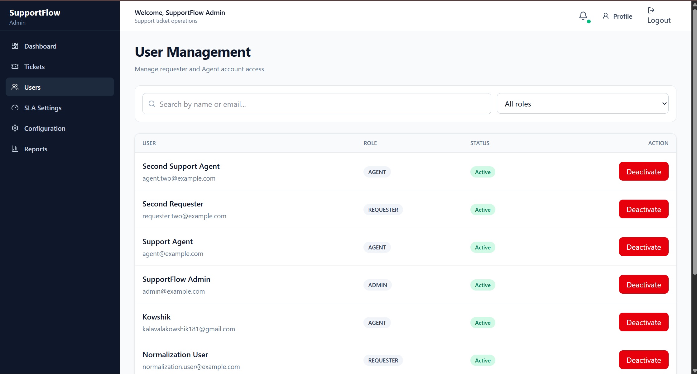

### Real-Time Notifications

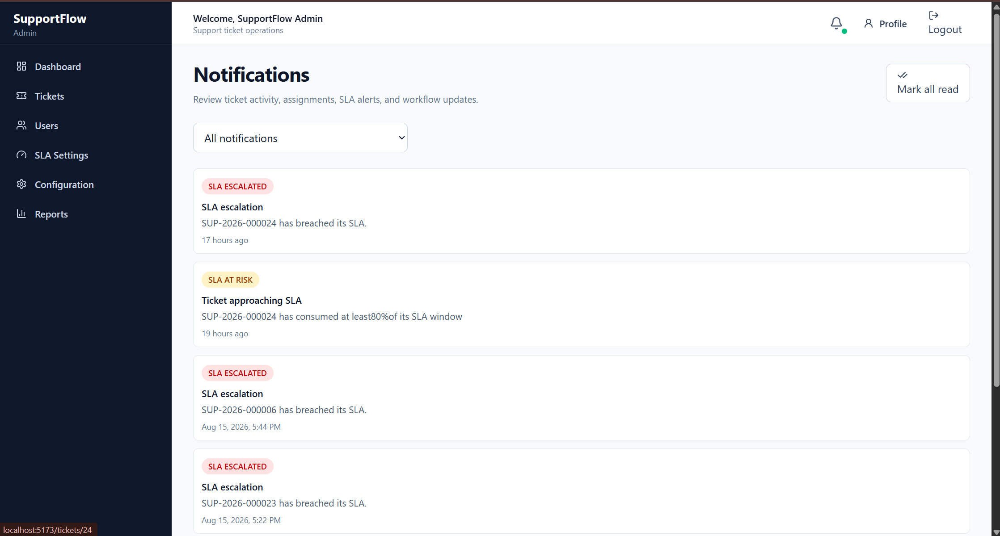

### Automated Testing Evidence

#### Backend pytest — 98 Tests Passed

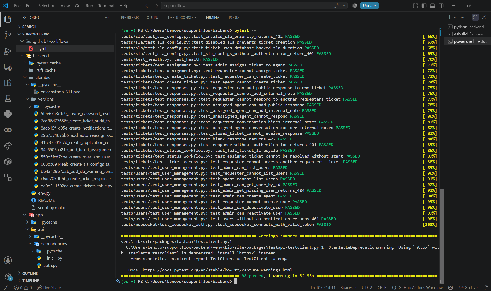

#### Playwright E2E — 24 Tests Passed

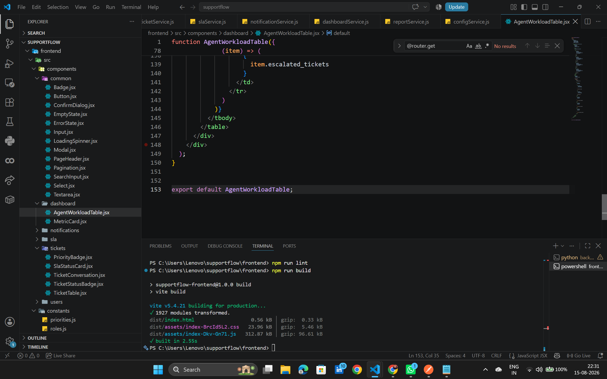

### Deliberate RED → GREEN Evidence

#### Deliberate RED Run

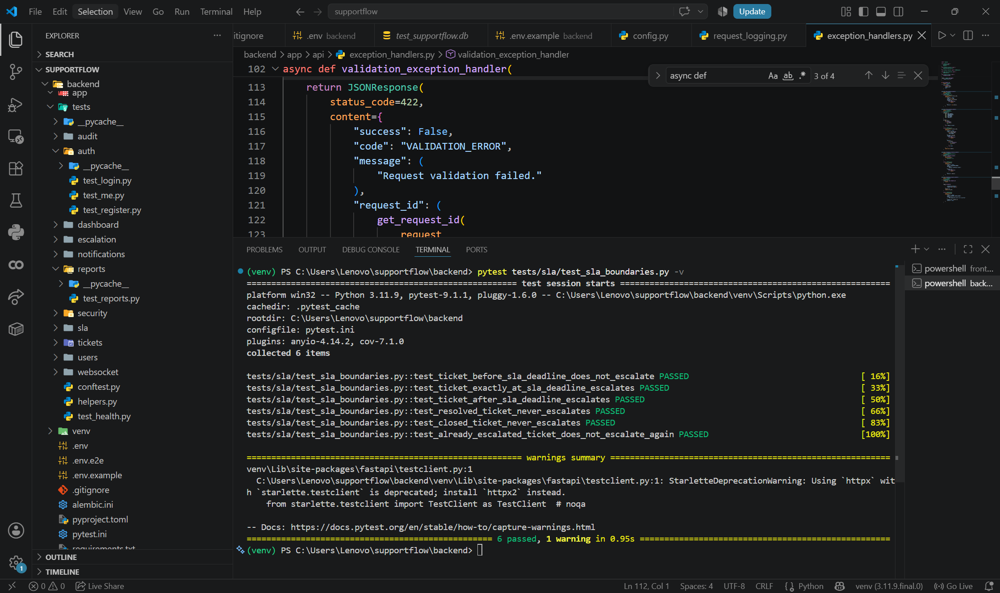

#### Corrected GREEN Run

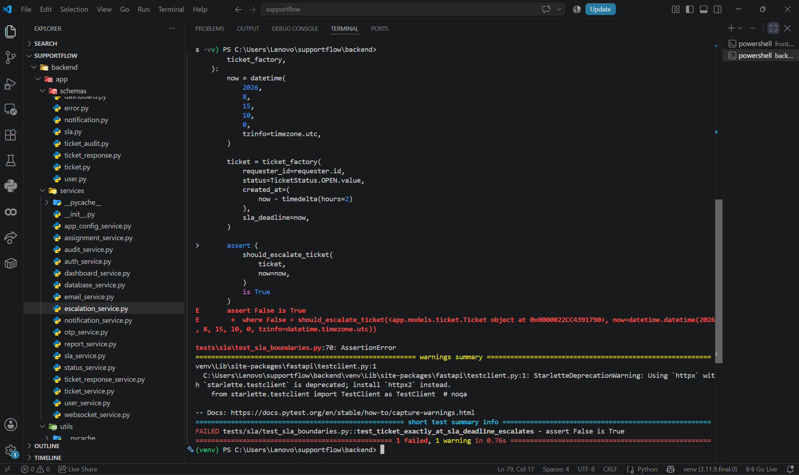

### GitHub Actions CI

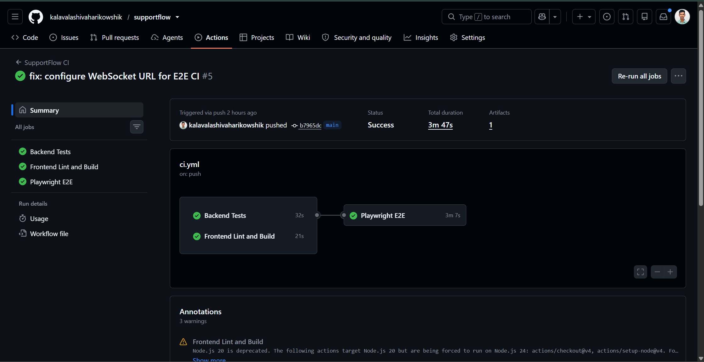
